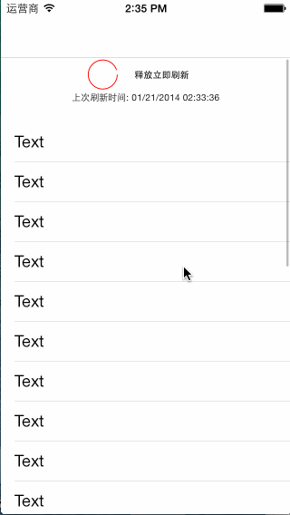

#ELRefresh
   
#installation
pod 'ELRefresh', '~> 0.0.1'   
#Usage
In your viewController's viewWillAppear function:   
(onceToken should be a property of you viewController);   
```
	dispatch_once(&_onceToken, ^{
        self.refreshView = [[ELRefreshView alloc] initWithScrollView:self.tableView refreshDirection:ELRefreshUpper];<br/>
        __weak ELViewController *weakSelf = self;
        self.refreshView.refreshBlock = ^{
          	[weakSelf doString];
        };
    });
```
